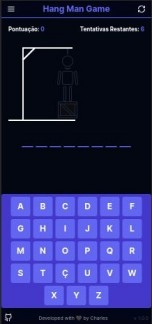
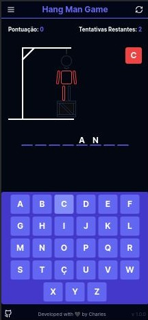
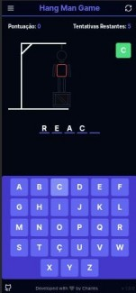
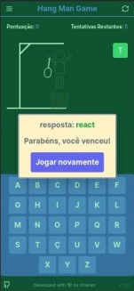
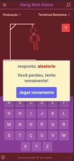

# Jogo da Forca

## Descrição

O Jogo da Forca é uma versão digital do clássico jogo de palavras onde os jogadores tentam adivinhar uma palavra oculta, arriscando letras a cada tentativa. O objetivo é descobrir a palavra antes de completar o desenho do enforcado.

Este repositório contém o código-fonte do Jogo da Forca, uma versão digital projetada para funcionar em ambientes web.







## Tecnologias

Este projeto foi desenvolvido utilizando as seguintes tecnologias:

- React.js
- Next.js
- Tailwind CSS
- TypeScript

## Configurar o Projeto em seu Ambiente

### 1. Clone o Repositório

```bash
git clone https://github.com/charles-mrt/hangman-game.git
```

### 2. Acesse a Pasta do Projeto

```bash
cd www
```

### 3. Instale as Dependências

```bash
npm install
```

### 4. Inicie o Projeto

```bash
npm run dev
```
   
O Jogo da Forca estará disponível em `http://localhost:3000`. Divirta-se!

## Como Jogar

1. Abra o jogo no seu navegador.
2. Aguarde a seleção aleatória de uma palavra oculta.
3. Arrisque letras para adivinhar a palavra.
4. Cada letra incorreta adiciona uma parte ao desenho do enforcado.
5. Se conseguir adivinhar a palavra antes de completar o desenho, você vence.
6. Se o desenho do enforcado estiver completo antes de adivinhar, você perde.
7. Divirta-se com o desafio do Jogo da Forca!


## Versão
1.0

## Próxima Versão

Melhorias na Interface e Adição de Recursos.

## Licença

Este projeto está sob a licença MIT.

---

Feito com ♥ por Charles Martins